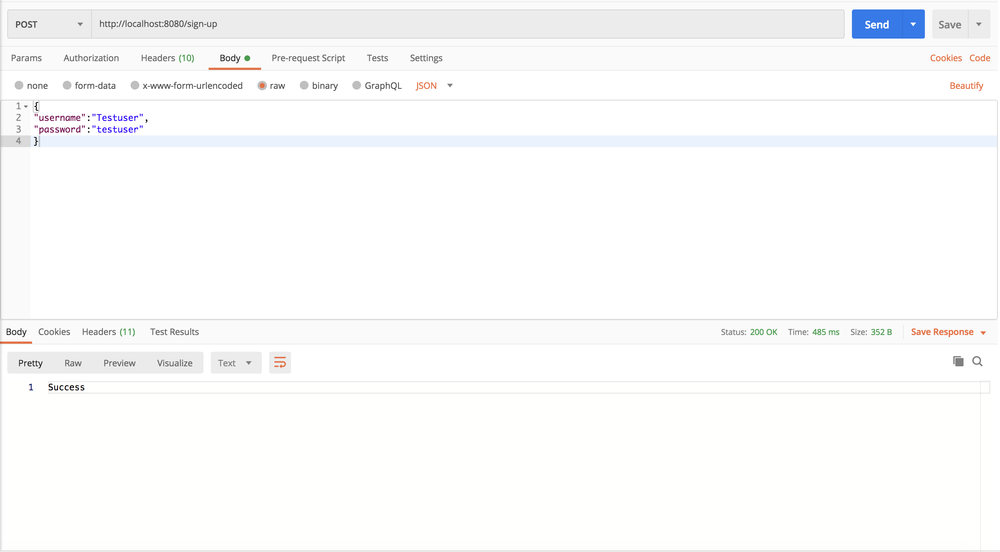
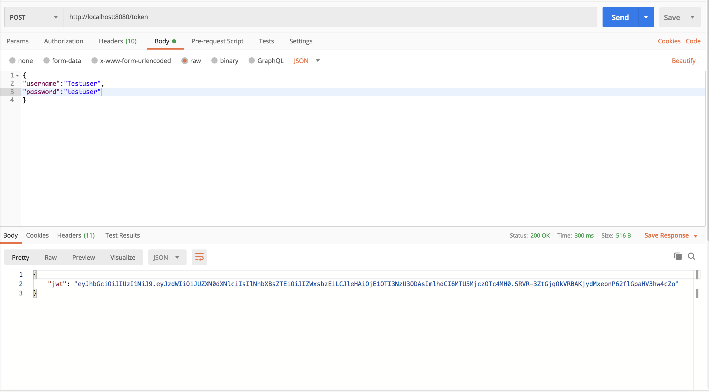
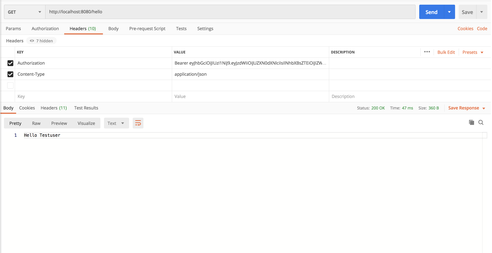

# SpringBoot_JWT

<b>JWT Authentication for the Spring boot APIs.</b>

In order to get an understanding of the JWT please refer this <a href="https://medium.com/@senthuranmanoharan/understanding-jwt-9b804e686bd7">blog</a>. This is a sample project on how we can
secure the Spring boot APIs using the JWT token. Please follow the below steps to access the Spring boot rest endpoint.

1. Need to Register into the system by calling the /sign-up endpoint.
   

   
   

2. Then invoke the /token endpoint to get the JWT Token.
   

   
   

3. After that call the /hello endpoint to get the result.
   

   
   

